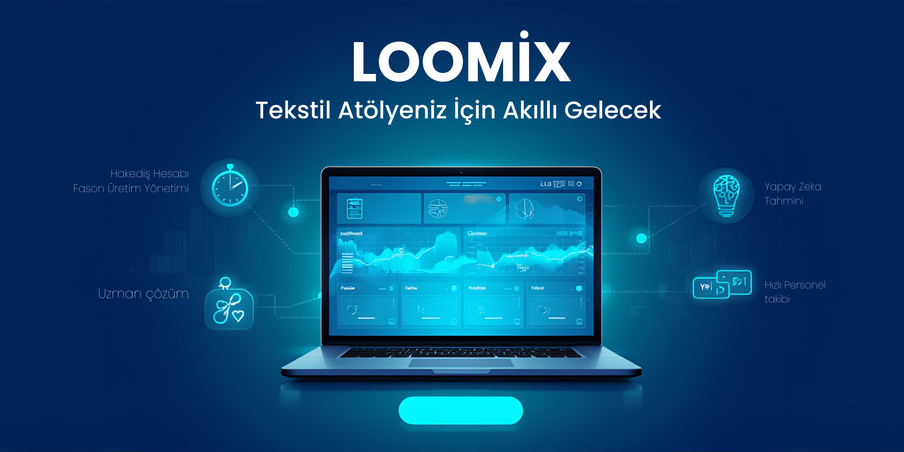

# PROJE ADI: LOOMİX

## Proje Hakkında

Proje Tanımı
Loomix, tekstil atölyelerinin karmaşık operasyonel ve finansal süreçlerini tek bir merkezden yönetmek için tasarlanmış modern bir Kurumsal Kaynak Planlama (ERP) yazılımıdır. Atölye sahiplerinin en büyük sancısı olan manuel hakediş hesaplamaları, üretim takibi ve maliyet öngörüsü problemlerine dijital bir çözüm sunar.

Sistemimiz; parmak izi okuma cihazlarından gelen ham verileri akıllı algoritmalarla işleyerek personel hakedişlerini hatasız bir şekilde hesaplar. Aynı zamanda fason üretim adetlerini model bazında anlık olarak takip ederken, yapay zeka desteğiyle geçmiş verileri analiz ederek gelecek haftaların maliyet ve bütçe planlamasını yapar. Loomix, atölyenizi sadece yönetmekle kalmaz; veriye dayalı kararlar alarak işletmenizin kârlılığını artırmanıza yardımcı olan akıllı bir iş ortağı görevi görür.

Proje Kategorisi
Loomix; Kurumsal Kaynak Planlama (ERP), Personel ve Finans Yönetimi ve Üretim Takip Sistemi kategorilerinde yer alan hibrit bir iş yönetim çözümüdür.

Referans Uygulama:
[Mikro Yazılım - Personel Yönetimi](https://www.mikro.com.tr/)

## Proje Linkleri
REST API Adresi: Geliştirme aşamasında (Yakında)

Web Frontend Adresi: Geliştirme aşamasında (Yakında)

## Proje Ekibi
Grup Adı: Anyone

Ekip Üyeleri:

Ahmet Yılmaz 

## Dokümantasyon

Proje dökümantasyonuna aşağıdaki linklerden erişebilirsiniz:

1. [Gereksinim Analizi](./Ahmet-Yilmaz/Ahmet-Yilmaz-Gereksinimler.md)
2. [REST API Tasarımı](./Ahmet-Yilmaz/Ahmet-Yilmaz-REST-API-Tasarimi.md)
3. [REST API](./Ahmet-Yilmaz/Ahmet-Yilmaz-Rest-API-Gorevleri.md)
4. [Web Front-End](./Ahmet-Yilmaz/Ahmet-Yilmaz-Web-Frontend-Gorevleri.md)
5. [Mobil Front-End](./Ahmet-Yilmaz/Ahmet-Yilmaz-Mobil-Frontend-Gorevleri.md)
6. [Mobil Back-End](./Ahmet-Yilmaz/Ahmet-Yilmaz-Mobil-Backend-Gorevleri.md)
7. [Video Sunum](./Ahmet-Yilmaz/Ahmet-Yilmaz-Sunum.md)